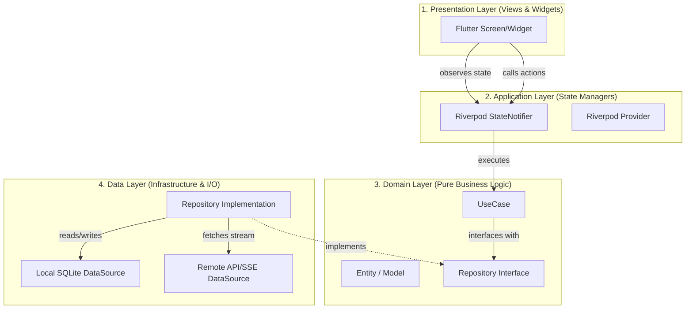

# Lotus Connect — Developer Guide & Architecture Blueprint

Welcome to the technical blueprint for **Lotus Connect**. This document details the architectural guidelines, codebase directory structures, and data flows of the platform, enabling you to ramp up quickly.

---

## 🗺️ Architectural Structure (Clean Architecture)

The codebase strictly follows **Clean Architecture** patterns separated into layer-decoupled directories. This prevents UI widgets from talking directly to database schemas, making files highly testable and modular.



### Decoupling Guidelines:
1. **Domain Layer (Pure Dart)**: Contains the core entities (e.g., `Message`, `Conversation`) and Use Cases. It has **zero dependencies** on Flutter, Riverpod, Drift, or network clients.
2. **Data Layer**: Coordinates database operations (via SQLite/Drift) and remote HTTP calls (via Dio/SSE Streaming).
3. **Application Layer**: Bridges the Domain and Presentation layers using **Riverpod 3.x** Notifiers.
4. **Presentation Layer**: Pure UI. Uses `ConsumerWidget` or `ConsumerStatefulWidget` to observe state notifier providers.

---

## 📂 Codebase Directory Overview

Here is where critical files are located in your workspace:

```text
lib/
├── app/
│   ├── bootstrap/          # App initialization, MaterialApp registration, L10n config
│   ├── router/             # GoRouter navigation paths
│   └── theme/              # Curated light, dark, and sepia color themes
├── core/
│   ├── database/           # Drift SQLite database setup & migrations
│   ├── errors/             # Custom Failure & Exception structures
│   └── services/           # Network & AI Engines (Ollama, Gemini, Mock)
├── features/
│   ├── chatbot/            # Core Chatbot Feature
│   │   ├── data/           # Repositories & SQL DataSources
│   │   ├── domain/         # Entities, Use Cases & Repository contracts
│   │   ├── application/    # Riverpod Notifiers (ActiveConversation, Settings)
│   │   └── presentation/   # UI Views & Widgets (ChatbotScreen, ChatInputField)
│   └── settings/           # Profile & System Preferences Feature
└── l10n/                   # Compiled localization classes (EN, VI, JA, ZH)
```

---

## 🔄 Core Technical Flows

### 1. SSE Token Streaming Pipeline
When you send a message, the app bypasses standard synchronous REST calls to support typing-style AI stream tokens:

1. The UI invokes `sendMessage(text)` on the `ActiveConversationNotifier`.
2. An **optimistic message** is generated immediately in memory and shown on the screen (0ms perceived latency).
3. `ChatbotRepository` initiates an HTTP connection using **Dio** and listens to the incoming response body stream chunk-by-chunk.
4. The stream parses **Server-Sent Events (SSE)** packets (e.g., `data: { ... }`).
5. As new token chunks arrive, the state notifier updates `streamingContent`, causing the UI to rebuild automatically in real time.
6. Once the stream ends, the completed assistant message is persistently stored in SQLite.

### 2. Persistent Settings Storage
Settings (Theme, Language, API Keys, active AI engines) are managed through a single source of truth:
* **Storage**: A Drift database table `AppSettingsTable` containing a single `'default'` configuration row.
* **Notifier**: `SettingsNotifier` loads settings asynchronously from Drift on launch, updating the Riverpod state.
* **Database Schema Migrations**: We configure `MigrationStrategy` on `AppDatabase` (Version `3`). If columns are added/removed in future upgrades, Drift drops and recreates the SQLite tables in development mode to avoid schema conflicts.

### 3. Dynamic Localizations (gen-l10n)
All UI labels are loaded using type-safe getters compiled from our `.arb` files:
1. Translators add labels to `lib/l10n/app_{en,vi,ja,zh}.arb`.
2. Running `flutter gen-l10n` builds the type-safe delegate keys.
3. Screens extract active locales reactively via Riverpod (`settings.languageCode`) and apply values using `AppLocalizations.of(context)!.someLabelKey`.

---

## 🛠️ Essential Development Commands

Keep these commands handy while maintaining the project:

* **Download Dependencies**:
  ```bash
  flutter pub get
  ```
* **Run Code Generation (Riverpod, Drift, Freezed)**:
  ```bash
  dart run build_runner build --delete-conflicting-outputs
  ```
* **Compile Localization Keys**:
  ```bash
  flutter gen-l10n
  ```
* **Run Static Code Analyzer**:
  ```bash
  flutter analyze
  ```
* **Run Unit Tests**:
  ```bash
  flutter test
  ```
